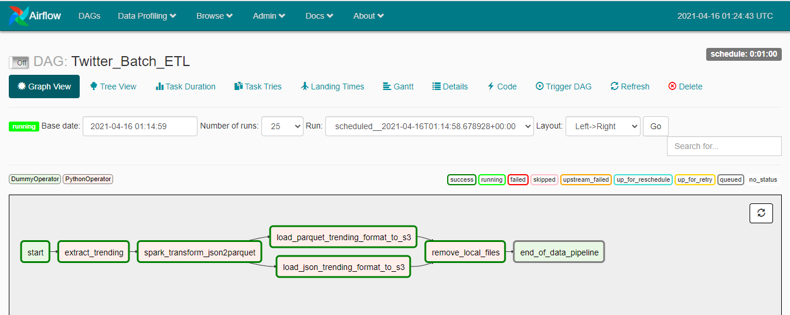
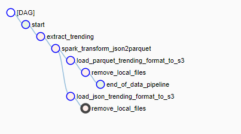
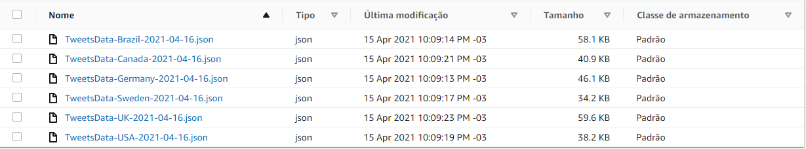
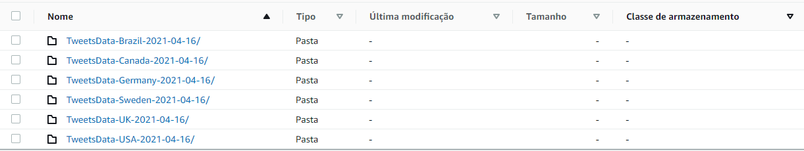
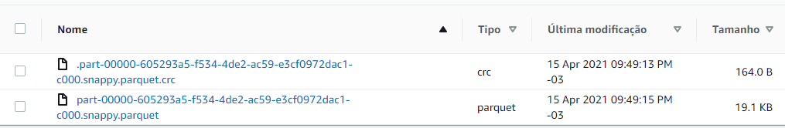

# Twitter Batch ETL

ETL que encontra os trending topics do Twitter em cinco países (Inglaterra, Brasil, Alemanha, Canada, EUA e Suécia), coleta tweets (dez por padrão) relacionados a cada tópico, realiza transformações para capturar os principais dados de cada tweet, salva os dados em formato json e os converte para parquet. Após isso, os arquivos (json e parquet) são enviados para um bucket no Amazon S3.

Confira os gráficos do Airflow (Grapth View e Tree View) que representam o pipeline:

<p align="center">
 
 <p>Graph View</p>
</p>

<p align="center">
 
 <p>Tree View</p>
</p>

Com os dados salvos, você pode conferir os arquivos json e parquet em seu bucket.

<p align="center">
 
 <p>Arquivos json</p>
</p>

Os arquivos parquet são salvos na estrutura *TweetsData-COUNTRY-yyyy-mm-dd/file.parquet*

<p align="middle">
  
   
</p>

## Dependências e Executar o projeto

- Uma conta configurada no [twitter para desenvolvedores](https://developer.twitter.com/en)
- Adicione suas credenciais do Tweepy no arquivo de configuração *(DAG/ETL_scripts/config.py)*. As credenciais são fornecidas após a criação da conta (passo acima): *consumer_key, consumer_secret, access_token e access_token_secret*
- Instale o [Docker](https://docs.docker.com/engine/install/ubuntu/) e [docker-compose](https://docs.docker.com/compose/install/)
- Crie uma conta na [AWS](https://aws.amazon.com/pt/free/) se ainda não possui (pode ser free tier)
- Instale o [aws cli](https://docs.aws.amazon.com/cli/latest/userguide/install-cliv2-linux.html)
- Crie e configure o seu [Bucket S3](https://docs.aws.amazon.com/AmazonS3/latest/userguide/creating-bucket.html)
- Modifique o *bucket_name* no arquivo de configuração *(DAG/ETL_scripts/config.py)* para o seu (criado no passo acima)

Após isso, execute o seguinte comando para criar o arquivo de configuração das suas credenciais da AWS:

```bash
$ aws configure
```

Finalmente, use os seguintes comandos:

```bash
$ git clone https://github.com/gustschaefer/Twitter-Batch-ETL
$ cd Twitter-Batch-ETL/
$ docker-compose up -d
```

Após o proceso terminar, acesse [http://localhost:8080/](http://localhost:8080/) para entrar na interface gráfica do Airflow.

O comando **docker-compose up -d** cria os containers necessários para o projeto, com seus volumes e variávies. Se desejar **instalar mais algum pacote**, adicione-o no arquivo *requirements.txt* e utilize o seguinte comando para reconstruir seus containers:

```bash
$ docker-compose up --build
```


